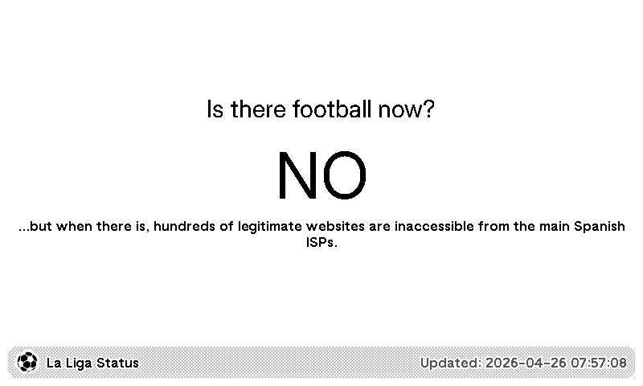
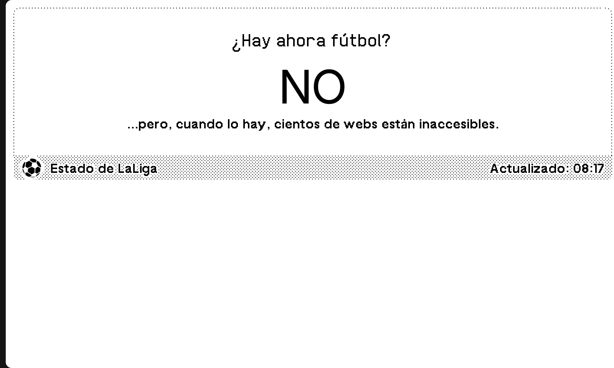
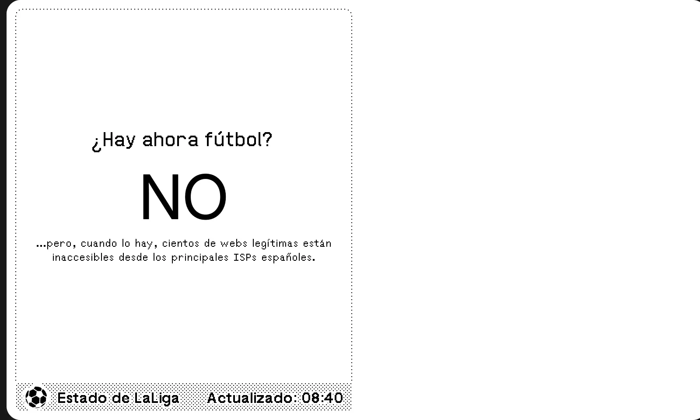
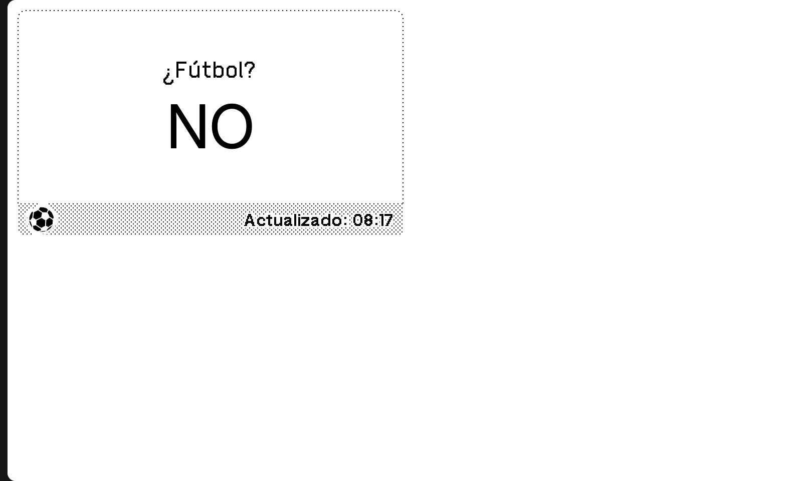

# TRMNL HTTP Pets

A TRMNL plugin to be happy seeing ducks and other animals while learning HTTP codes!

## Icon

The plugin icon is stored in the TRMNL bundle and referenced from settings.yml.

	

## Previews

| Full View | Half Horizontal View |
|------------|----------------------|
|  |  |

| Half Vertical View | Quadrant View |
|-------------------|----------------|
|  |  |

## Templates

- All templates have the same "view". This view is the randomized HTTP code image, with a black background for a better and more concise experience.