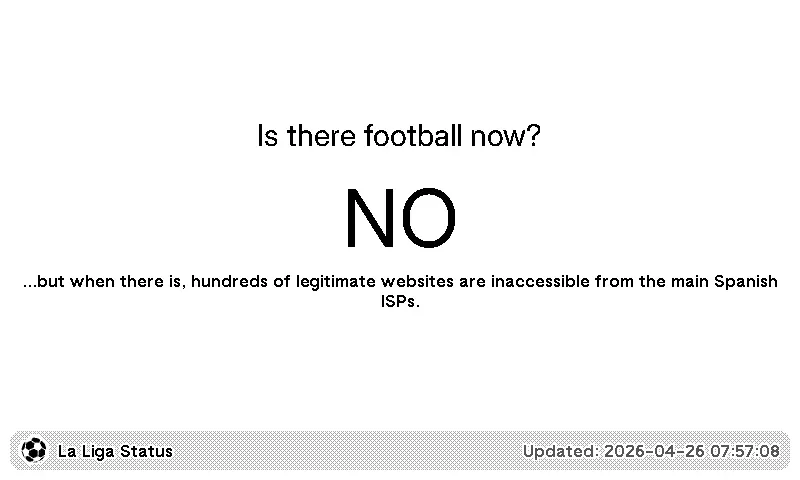
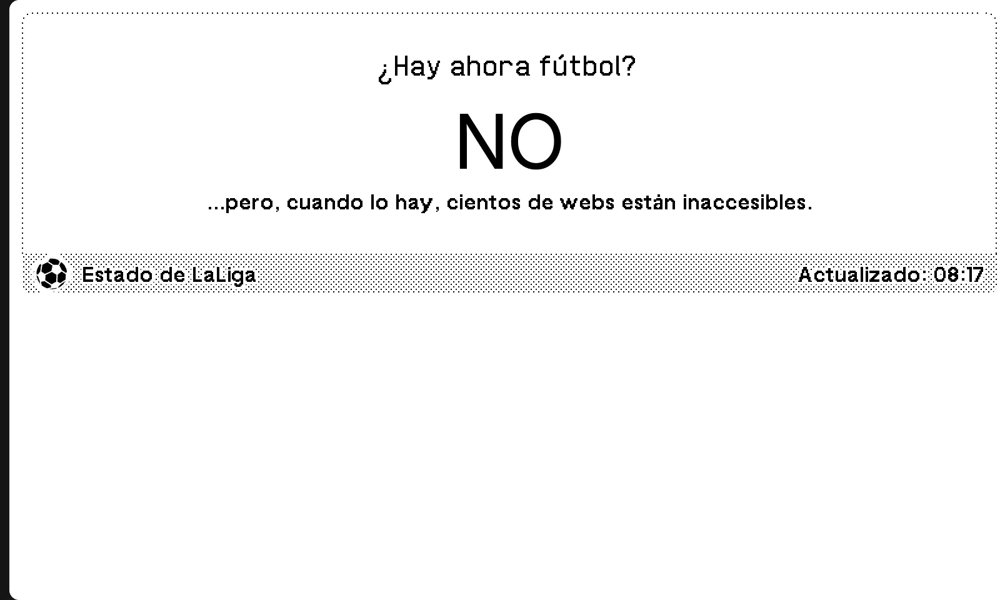
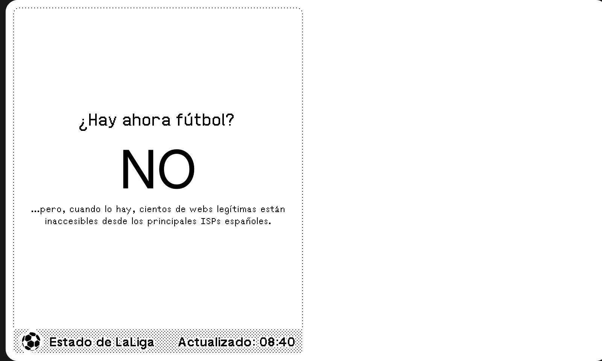
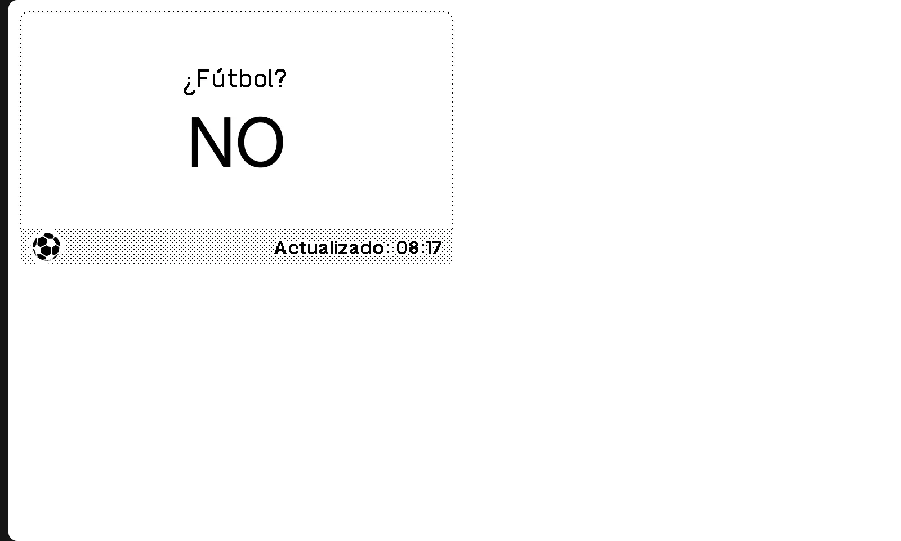

# TRMNL HTTP Pets

A TRMNL plugin to be happy seeing ducks and other animals while learning HTTP codes!

## Icon

The plugin icon is stored in the TRMNL bundle and referenced from settings.yml.

	

## Previews

| Full View | Half Horizontal View |
|------------|----------------------|
|  |  |

| Half Vertical View | Quadrant View |
|-------------------|----------------|
|  |  |

## Templates

- All templates have the same "view". This view is the randomized HTTP code image, with a black background for a better and more concise experience.

## Setup

Choose an animal source or All, save, and refresh to generate a random HTTP-code image. No API key is needed.

For image tone calibration, see the [script instructions](../scripts/README.md).

## Public recipe review

The original plugin design, parsing logic and markup are also offered under [CC BY 4.0](../LICENSE), matching [TRMNL’s public plugin license](https://trmnl.com/plugin-license). Third-party content keeps its own terms. For support, [open a GitHub issue](https://github.com/taichikuji/trmnl-http-pets-plugin/issues).

The pet photos and raster favicon use `image-dither`. Serverless selects a source
and status code and looks up the image tone; it makes no network requests.

Before submitting, save each setting in TRMNL, check all four views on OG and X (landscape and portrait), use a public demo preview, and review CHEF feedback. Repository checks and a successful upload do not replace these dashboard checks or human approval.
